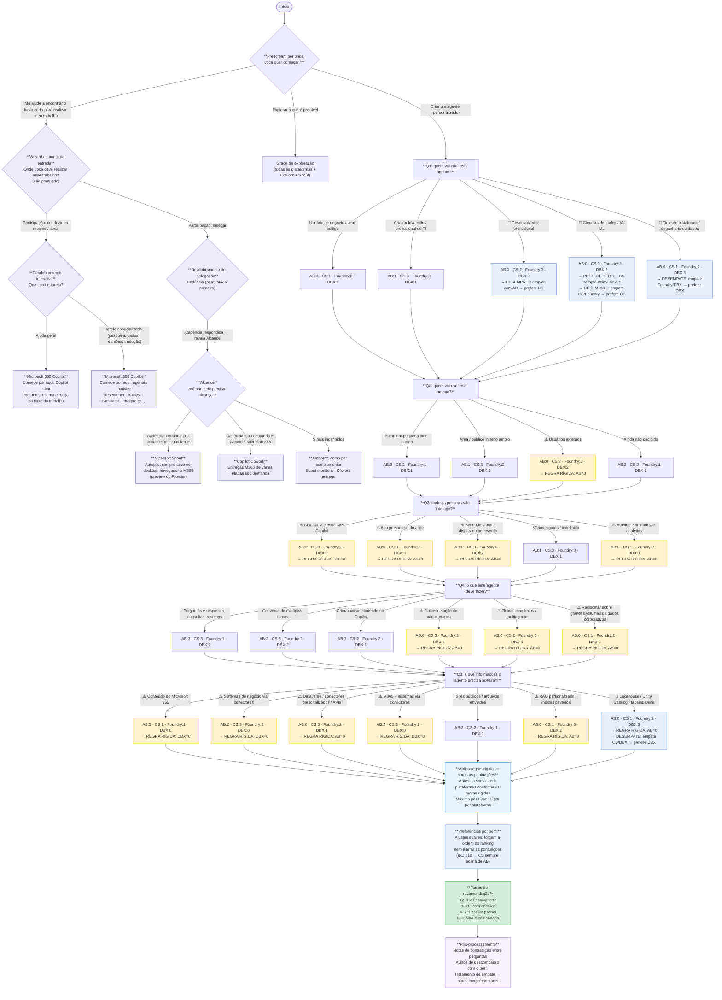

# Árvore de decisão

Fluxo completo do advisor: o prescreen, o wizard de ponto de entrada (não pontuado)
e a avaliação pontuada de agente personalizado.

## Legenda das plataformas

As caixas de pontuação usam abreviações. Cada pergunta atribui de 0 a 3 pontos a cada
uma das quatro plataformas da avaliação pontuada:

| Sigla | Plataforma | Papel na avaliação |
|---|---|---|
| **AB** | Agent Builder | Agentes declarativos no-code dentro do Microsoft 365 Copilot |
| **CS** | Copilot Studio | Agentes corporativos low-code governados, com ações e fluxos |
| **Foundry** | Microsoft Foundry | Agentes de produção code-first com runtime gerenciado |
| **DBX** | Databricks Agent Bricks | Agentes construídos e servidos no lakehouse, governados pelo Unity Catalog |

**Databricks Agent Bricks (DBX)** é a única opção não-Microsoft da matriz. Ele só
pontua alto quando o cenário está ancorado na plataforma de dados: conhecimento
governado pelo Unity Catalog, grandes coleções de documentos, ou o time de plataforma
de dados como responsável pela construção. Como não consegue se fundamentar em conteúdo
do Microsoft 365 nem publicar no chat do Microsoft 365 Copilot, três regras rígidas o
zeram: `q3a`, `q3b` e `q3d` (fontes do Microsoft 365) e `q2a` (implantação no chat do
Copilot). Dois critérios de desempate favorecem o DBX: `q3g` (conhecimento no lakehouse,
empate CS/DBX) e `q1e` (time de plataforma de dados, empate Foundry/DBX).

O **Microsoft 365 Copilot**, o **Copilot Cowork** e o **Microsoft Scout** não fazem parte
da pontuação de 0 a 15. Eles são alcançados apenas pelo wizard de ponto de entrada.

Símbolos usados no diagrama: ⚠️ = a resposta dispara uma regra rígida · 🔀 = a resposta
dispara um desempate ou preferência por perfil.

## Diagrama

